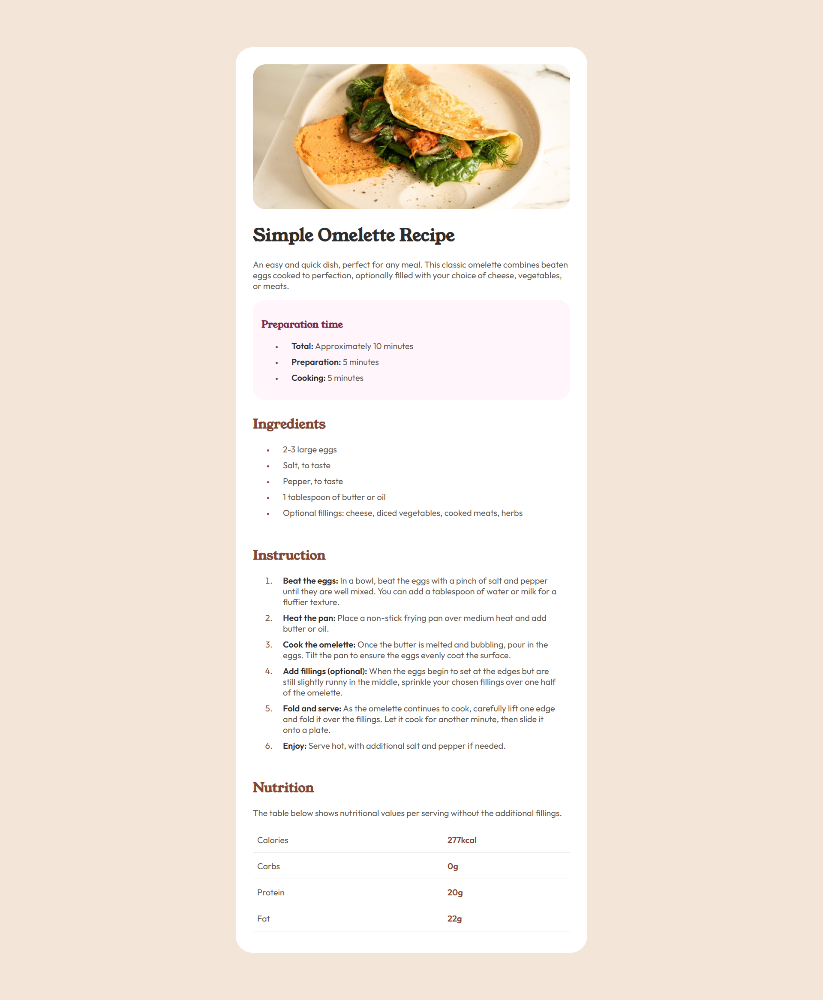

# Frontend Mentor - Recipe page solution

This is my solution to the [Recipe page challenge on Frontend Mentor](https://www.frontendmentor.io/challenges/recipe-page-KiTsR8QQKm). The goal of this project was to recreate a recipe page from a provided design while practicing semantic HTML and CSS styling.

## Table of contents

- [Overview](#overview)
  - [The challenge](#the-challenge)
  - [Screenshot](#screenshot)
  - [Links](#links)
- [My process](#my-process)
  - [Built with](#built-with)
  - [What I learned](#what-i-learned)
  - [Continued development](#continued-development)
  - [AI Collaboration](#ai-collaboration)
- [Author](#author)

## Overview

### Screenshot



### Links

- Solution URL: [Git Repository](https://github.com/Ismaellerakotoson/recipe-page.git)
- Live Site URL: [Live Demo](https://recipe-page-azure-eta.vercel.app/)

## My process

### Built with

- Semantic HTML5
- CSS Custom Properties
- Flexbox
- Mobile-first workflow
- Google Fonts

### What I learned

This project helped me strengthen my understanding of semantic HTML and list styling in CSS.

Using Ordered Lists for Numbered Instructions

I learned that the <ol> element is the most appropriate choice when displaying a sequence of steps because it provides numbering automatically and improves semantic meaning.

```html
<ol>
  <li>
    <span>Beat the eggs:</span> In a bowl, beat the eggs with a pinch of salt
    and pepper until they are well mixed. You can add a tablespoon of water or
    milk for a fluffier texture.
  </li>
  <li>
    <span>Heat the pan:</span> Place a non-stick frying pan over medium heat and
    add butter or oil.
  </li>
</ol>
```

Customizing List Markers

I discovered that the ::marker pseudo-element can be used to style the bullets of unordered lists and the numbers of ordered lists.

```css
ul li::marker {
  color: var(--Brown800);
  font-size: 0.8rem;
}
```

### Continued development

For future projects, I would like to continue improving:
- Accessibility best practices
- Responsive layouts
- CSS architecture and organization
- Advanced typography and spacing techniques

### AI Collaboration

I used ChatGPT during this project to:

- Better understand semantic HTML structure
- Learn how to style list markers with ::marker
- Improve accessibility and typography choices
- Review my code and identify areas for improvement

The explanations helped me understand the reasoning behind the solutions rather than simply copying code.

## Author

- Frontend Mentor - [@Ismaellerakotoson](https://www.frontendmentor.io/profile/Ismaellerakotoson)